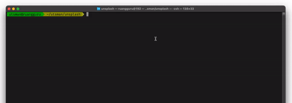

<h1 align="center">
  KARTIKA SARI PUTRI
</h1>

<p align="center">
  
</p>

<p align="center">
  <a href="https://www.npmjs.com/package/kartika"></a>
  <a href="LICENSE"></a>
  <a href="https://github.com/utsmannn/bacot/pulls"></a>
  <a href="https://twitter.com/utsmannn"></a>
  <a href="https://github.com/utsmannn"></a>
  <h3 align="center">Tool for generating multidensity drawable on android project with webp converter support</h3>
</p>

<p align="center">
  
</p>


## Download
```
npm install -g kartika
```

## Usage
```
// for all image in directory
kartika .

// for specified image
kartika image-blabla-bla.jpg image-anunu-nu.png
```

## Webp support
```
kartika --webp image-blabla-bla.jpg image-anunu-nu.png
```

## Result report
```                                                                                                 
                  filename │    ldpi    │    mdpi    │    hdpi    │    xhdpi    │   xxhdpi    │   xxxhdpi   │ Original  │ Saved size 
───────────────────────────┼────────────┼────────────┼────────────┼─────────────┼─────────────┼─────────────┼───────────┼────────────
 austin-chan-ukzHl....webp │   50.308KB │   70.352KB │   50.308KB │   171.032KB │   305.594KB │   392.924KB │ 907.947KB │   515.03KB 
                           │ (1037x691) │ (1296x864) │ (1037x691) │ (2592x1728) │ (4147x2765) │ (5184x3456) │           │            
───────────────────────────┼────────────┼────────────┼────────────┼─────────────┼─────────────┼─────────────┼───────────┼────────────
 raimond-klavins-u....webp │   73.812KB │    96.66KB │   73.812KB │    232.94KB │    438.83KB │   570.686KB │    1.31MB │   762.14KB 
                           │ (1123x749) │ (1404x936) │ (1123x749) │ (2808x1872) │ (4493x2995) │ (5616x3744) │           │            
───────────────────────────┼────────────┼────────────┼────────────┼─────────────┼─────────────┼─────────────┼───────────┼────────────
 jake-blucker-tMzC....webp │    4.454KB │    6.294KB │    4.454KB │    22.804KB │    58.474KB │    84.548KB │ 222.897KB │   138.35KB 
                           │  (144x216) │  (180x270) │  (144x216) │   (360x540) │   (576x864) │  (720x1080) │           │            

```

---
```
Copyright 2021 Muhammad Utsman

Licensed under the Apache License, Version 2.0 (the "License");
you may not use this file except in compliance with the License.
You may obtain a copy of the License at

    http://www.apache.org/licenses/LICENSE-2.0

Unless required by applicable law or agreed to in writing, software
distributed under the License is distributed on an "AS IS" BASIS,
WITHOUT WARRANTIES OR CONDITIONS OF ANY KIND, either express or implied.
See the License for the specific language governing permissions and
limitations under the License.
```

